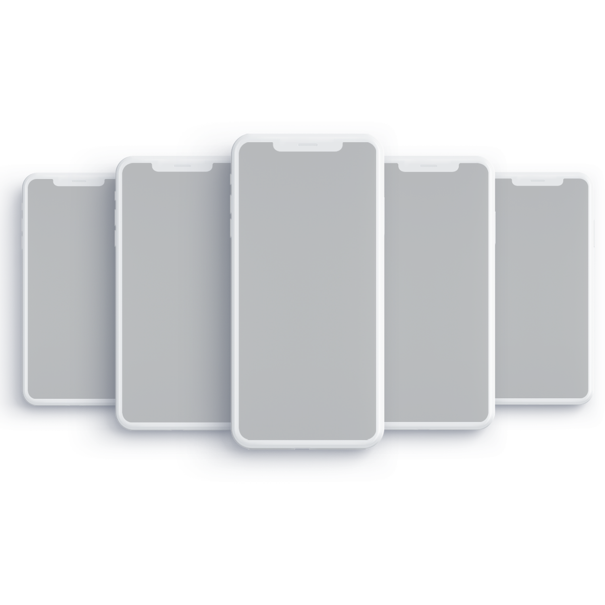

# WEB
web midterm
<!DOCTYPE html>
<html>
<head>
	<title>iInfo - Official Apple Reseller</title>
	<link rel="stylesheet" href="midka.css">
	<link rel="preconnect" href="https://fonts.gstatic.com">
	<link rel="preconnect" href="https://fonts.gstatic.com">
	<link href="https://fonts.googleapis.com/css2?family=Oswald:wght@600&display=swap" rel="stylesheet">
	<link href="https://fonts.googleapis.com/css2?family=Raleway:wght@100;200&display=swap" rel="stylesheet">
	<link rel="preconnect" href="https://fonts.gstatic.com">
	<link href="https://fonts.googleapis.com/css2?family=Roboto:wght@300&display=swap" rel="stylesheet">
	<link rel="shortcut icon" type="image/x-icon" href="apple.png" /> 	
</head>
<body> 
	

		

			iInfo
			
		

		

  			

  				   
				
				<h2>iPhone</h2>
			

			

				      
				
				<h2>Mac</h2>
    		

    	

  	

  		<h1 class="header"> Apple </h1>
  		
 <b>Apple</b> is an American multinational technology company headquartered in Cupertino, California, that designs, develops, and sells consumer electronics, computer software, and online services. It is considered one of the <b>Big Five companies in the U.S.</b> information technology industry, along with Amazon, Google, Microsoft, and Facebook.

  		<iframe width="800" height="450"
			src="https://www.youtube.com/embed/cnXapYkboRQ?autoplay=1">
		</iframe>
		 
		<a href="nextpage.html">
			<h2>More Info</h2>
		</a>
		<a href="accessories.html">
			<h2>Accessories</h2>
		</a>
  	

 	

		

			 
			 
			 
					
 			<h2>iPad</h2>
 		

 		

 			 
			 
			 
					
 			<h2>Watch</h2>
 		

 	

<footer>
	 
	 
	 
	 
	 
	 
	<h2>Made by Nurgissa Izturgan</h2>
	<h3>+7(777) 777 77 77</h3>
	  
	 
	
</footer>
</body>
</html>
body, html {
  width: 100%;
  height: 100%;
  margin: 0;
}

.container {
  width: 100%;
  height: 100%;
}

h2{
  font-family: 'Raleway', sans-serif;
}

.leftpane {
  text-align: center;
  width: 15%;
  height: 100%;
  float: left;
  background-color: grey;
  border-collapse: collapse;
}

.leftpanetop{
  text-align: center;
}

.leftpanebottom{
  text-align: center;
}

.leftpanetop:hover{
  transition:  0.6s;
  -webkit-filter: invert(100%);
  filter: invert(100%);
}

.leftpanebottom:hover{
 transition:  0.6s; 
  -webkit-filter: invert(100%);
  filter: invert(100%);
}

.header{
    font-family: 'Oswald', sans-serif;
    font-size: 35px;
}

.info{
  padding-left: 100px;
  padding-right: 100px;
  font-family: 'Roboto', sans-serif;
}

.middlepane {
    text-align: center;
    width: 70%;
    height: 100%;
    float: left;
    background-color: white;
}

.rightpanetop:hover{
  transition:  0.6s;
  -webkit-filter: invert(100%);
  filter: invert(100%);
}

.rightpanebottom:hover{
  transition:  0.6s;
  -webkit-filter: invert(100%);
  filter: invert(100%);
}

.rightpane {
  -webkit-filter: invert(100%);
  filter: invert(100%);
  text-align: center;
  width: 15%;
  height: 100%;
  position: relative;
  float: right;
  background-color: grey;
  border-collapse: collapse;
}

.toppane {
  font-size: 70px;
  font-family: 'Roboto', sans-serif;
  color: white;
  width: 100%;
  height: 100px;
  padding-top: 4px;
  text-align: center;
  background-color: black;
}
a:link {
  color: black;
  background-color: transparent;
  text-decoration: none;
}

a:visited {
  color: black;
  background-color: transparent;
  text-decoration: none;
}

a:hover {
  color: black;
  background-color: transparent;
  text-decoration: underline;
}

a:active {
  color: black;
  background-color: transparent;
  text-decoration: underline;
}

footer{
  color: white;
  background-color: black;
  font-family: 'Awesome', sans-serif;
  text-align: center;
}
